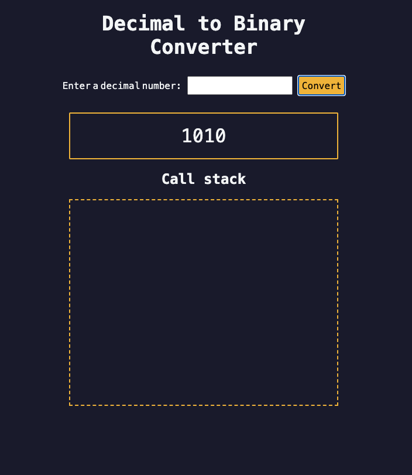

# Decimal to Binary Converter with Call Stack Animation

This project is a web-based application that converts a decimal number into its binary equivalent. It demonstrates recursion, DOM manipulation, input validation, and call stack visualization through animations.

---

## 🚀 Features
- Converts decimal numbers to binary using a **recursive function**.
- **Call stack visualization**: Animates the process of recursive calls step-by-step.
- Validates user input to ensure only non-negative integers are processed.
- User-friendly interface: Input through a text field, button, or "Enter" key.

---

## 📂 Project Structure

- **HTML**: Provides the basic structure for the interface.
- **CSS**: Styles the UI elements and animations.
- **JavaScript**: Implements the logic, animations, and event handling.

---

## 🛠️ Technologies Used

- **HTML5**
- **CSS3**
- **JavaScript (ES6)**

---

## 📖 How It Works

1. **Input Handling**:
   - User enters a decimal number into the input field.
   - The app validates that the input is a non-negative integer.

2. **Recursive Conversion**:
   - The `decimalToBinary` function computes the binary representation of the input.

3. **Call Stack Animation**:
   - Animates each recursive call as a stack frame.
   - Shows explanatory messages for each step of the recursion.

4. **Output**:
   - Displays the binary result after the animation completes.

---

## 📜 Code Highlights

### Recursion Function

The recursive function `decimalToBinary` converts a decimal number into binary:

```javascript
const decimalToBinary = (input) => {
  if (input === 0 || input === 1) {
    return String(input); // Base case
  } else {
    return decimalToBinary(Math.floor(input / 2)) + (input % 2); // Recursive case
  }
};
```

### Call Stack Animation

Visualizes the recursion process with animations using `setTimeout`:

```javascript
animationData.forEach((obj) => {
  setTimeout(() => {
    animationContainer.innerHTML += `
      <p id="${obj.inputVal}" class="animation-frame">
        decimalToBinary(${obj.inputVal})
      </p>
    `;
  }, obj.addElDelay);

  setTimeout(() => {
    document.getElementById(obj.inputVal).textContent = obj.msg;
  }, obj.showMsgDelay);

  setTimeout(() => {
    document.getElementById(obj.inputVal).remove();
  }, obj.removeElDelay);
});
```

### Input Validation

Ensures the user provides a valid non-negative integer:

```javascript
if (!numberInput.value || isNaN(inputInt) || inputInt < 0) {
  alert("Please provide a decimal number greater than or equal to 0");
  return;
}
```

---

## 🎨 Screenshots

### Input Section


---

## 🚦 Usage Instructions

1. Clone the repository:
   ```bash
   git clone https://github.com/your-username/decimal-to-binary-converter.git
   ```
2. Open `index.html` in any modern browser.

3. Enter a decimal number in the input field and click "Convert" or press "Enter".

4. Watch the call stack animation and view the binary result.

---

## 📚 Topics Covered

- Recursion
- DOM Manipulation
- Event Handling
- Input Validation
- Timers and Delays
- Call Stack Visualization

---

## 🌟 Future Enhancements

- Add a feature to convert binary to decimal.
- Optimize animations for larger inputs.
- Improve UI/UX with better design and responsiveness.
- Add debugging tools for step-by-step traversal.

---

## 🤝 Contributing

Contributions are welcome! Feel free to open issues or submit pull requests to enhance the project.

---
# decimal-to-binary-converter
